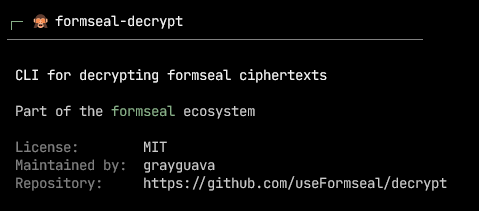

<p align="center">
  
</p>

<p align="center">
  
  
  
  
</p>

<p align="center">
  Decrypt formseal ciphertexts locally.
</p>

---

formseal-decrypt decrypts form submissions downloaded by formseal-fetch. Nothing is decrypted in transit or on the server — only the holder of the private key can read submissions.

formseal-decrypt is not a hosted service or dashboard. It is a CLI decryption utility.

---

## Installation

**Via pipx (recommended)**

```bash
pipx install formseal-decrypt
```

**Via pip**

```bash
pip install formseal-decrypt
```

---

## Quick start

```bash
fsd connect
fsd decrypt
fsd status
```

---

## How it works

```
Browser (formseal-embed)
       │
       ▼ (encrypted submissions)
 Your server / endpoint
       │
       ▼ (fsf fetch)
 ciphertexts.jsonl ──► Your PC
       │
       ▼ (fsd decrypt)
  formseal.decrypted.jsonl (canonical JSONL ledger)
```

Your backend stores opaque ciphertext only. `fsf fetch` downloads it. `fsd decrypt` decrypts it offline with your private key.

---

## Commands

| Command | Description |
|---------|-------------|
| `fsd` | Show about / info |
| `fsd connect` | Configure source, destination, and private key |
| `fsd decrypt` | Decrypt ciphertexts |
| `fsd status` | Show configuration |
| `fsd disconnect` | Clear credentials |
| `fsd disconnect --wipe` | Clear everything including messages |

Run `fsd --help` for all options.

---

## Output formats

`fsd decrypt` always writes `formseal.decrypted.jsonl` as the canonical JSONL ledger. Pass `--format` for additional exports:

- **CSV** — Spreadsheet-compatible
- **JSONL** — One JSON object per line (canonical)
- **JSON** — Pretty-printed JSON array
- **Markdown** — Table view

---

## Security

Your private key never leaves your machine. formseal-decrypt:

- Stores credentials in your OS keychain (Windows Credential Manager / macOS Keychain / Linux Secret Service)
- Decrypts locally only
- Sends no telemetry, has no analytics
- Skips already-decrypted messages automatically

---

## Documentation

Full documentation is in the [docs](./docs/README.md) directory.

---

⭐ Please star the repo if you find formseal-decrypt useful.

---

## License

MIT